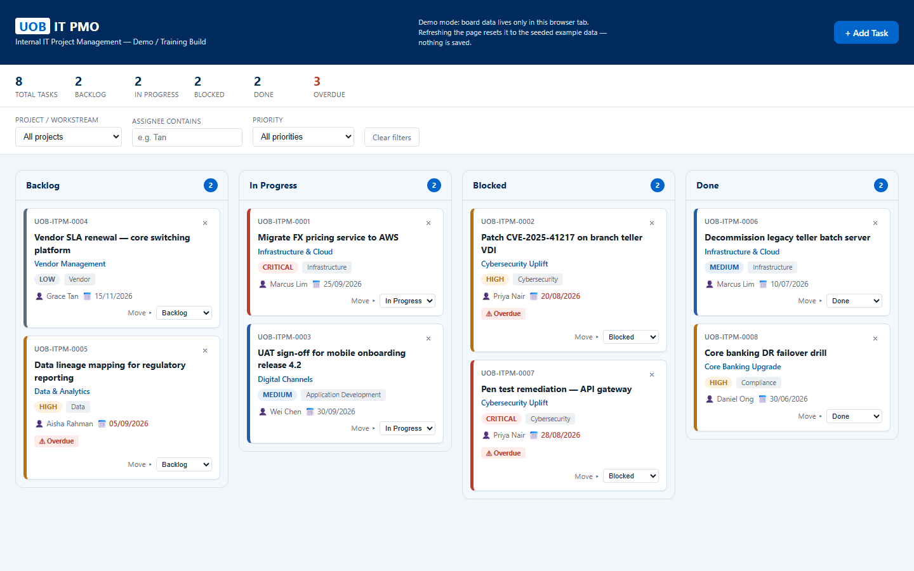

# CCKanbanBoard

A single-file demo/training Kanban board for **UOB IT PMO** — an internal IT project management tool.

## What this is

The entire application (markup, styles, logic) lives in one file: `index.html`. There is no build, lint, or test tooling, no `package.json`, and no server.

## Running it

Open `index.html` directly in a browser (double-click, or `file://` path). No install step, no dev server, no compilation.

## Hard constraints

- **Vanilla HTML/CSS/JS only** — no frameworks, no build step, no bundler, no npm packages, no external CDN scripts/fonts/images. Everything stays inline in `index.html`.
- **No persistence of any kind** — board state is an in-memory JS object only and resets on page refresh.
- **FormSubmit is the only network call** — used purely to email-notify on new task creation, non-blocking on failure.
- All seed data (task titles, CVE numbers, assignee names, etc.) is fabricated placeholder content for demo purposes.

See [CLAUDE.md](CLAUDE.md) for full architecture notes.
